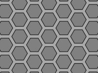
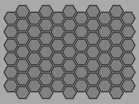
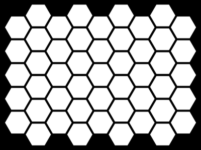

# HEX Grid Tessellator

A CLI tool that generates publication-quality hexagonal grid tessellation PNG images. Uses flat-top hexagons on an axial coordinate system with supersampled anti-aliasing. Runs as a standalone Windows `.exe` - no Python installation required.

I created `hextessellator.exe` to generate transparency masks that I use for graphic design projects, like the one below.


## Quick Start

Download `hextessellator.exe` from `dist/` and run:

```bash
# Generate with defaults (1024x768, high anti-aliasing)
hextessellator.exe

# Custom render
hextessellator.exe --width 1920 --height 1080 --circumradius 48 --antialias high --debug

# Save/load settings
hextessellator.exe --export_settings my_config.json
hextessellator.exe --import_settings my_config.json
```

## Examples

   


## CLI Reference

| Argument | Type | Default | Description |
|----------|------|---------|-------------|
| `--width` | int | 1024 | Image width in pixels |
| `--height` | int | 768 | Image height in pixels |
| `--circumradius` | float | 64.0 | Hexagon circumradius *R* in pixels |
| `--margin` | float | 16.0 | Gap between hexagon edges in pixels |
| `--line_width` | int | 8 | Stroke width in pixels (0 = no outline) |
| `--layers` | int | 0 | Concentric layers (0 = auto-fill canvas) |
| `--color_fill` | str | grey | Hexagon fill colour |
| `--color_line` | str | black | Hexagon outline colour |
| `--color_background` | str | darkgrey | Background colour |
| `--antialias` | str | high | Anti-alias level: off, low, medium, high |
| `--file` | str | tessellation.png | Output PNG filename |
| `--cull` | bool | false | Enable viewport culling |
| `--debug` | bool | false | Print detailed parameters and statistics |
| `--export_settings` | str | | Export parameters to a JSON file |
| `--import_settings` | str | | Import parameters from a JSON file |

Colours accept CSS named colours (`red`, `steelblue`), hex codes (`#FF0000`, `#F00`), and comma-separated RGB (`255,128,0`).

## Architecture

All application code resides in a single file (`main.py`) with six classes:

```
Application          CLI parsing, orchestration, banner, debug output
  +-- SettingsManager    JSON import/export with CLI-precedence merging
  +-- ColorParser        CSS names, hex codes, RGB tuples -> (R,G,B)
  +-- TessellationRenderer
        +-- AxialGrid        Coordinate system, ring traversal, auto-fill
        +-- HexagonGeometry  Vertex computation for flat-top hexagons
```

---

## Mathematical Foundations

### 1. Regular Hexagon Geometry

A regular hexagon is a six-sided polygon with all sides and interior angles equal. The tool uses the **flat-top** orientation, where the topmost edge is horizontal.

#### Circumradius and Inradius

The hexagon is defined by its **circumradius** *R* (centre-to-vertex distance). The **inradius** (apothem) *r* is the centre-to-edge distance:

$$r = R \cdot \frac{\sqrt{3}}{2}$$

The relationship between circumradius and inradius follows directly from the 30-60-90 triangle formed by the centre, a vertex, and the midpoint of an adjacent edge.

#### Vertex Generation

For a flat-top hexagon centred at (*c_x*, *c_y*), the six vertices are computed by sampling the circumscribed circle at 60° intervals:

$$V_k = \left( c_x + R \cos\!\left(\frac{\pi k}{3}\right),\; c_y + R \sin\!\left(\frac{\pi k}{3}\right) \right), \quad k = 0, 1, \ldots, 5$$

where *k* = 0 corresponds to the rightmost vertex at (*c_x* + *R*, *c_y*) and vertices proceed counter-clockwise.

### 2. Axial Coordinate System

The grid uses the **axial coordinate system** (also called "trapezoidal" or "skewed") for hexagonal grids, parameterised by two integers (*q*, *r*).

#### Coordinate-to-Pixel Conversion

For flat-top hexagons with spacing radius *R_s*, the axial-to-pixel transform is:

$$p_x = R_s \cdot \frac{3}{2} \cdot q$$

$$p_y = R_s \cdot \sqrt{3} \cdot \left( r + \frac{q}{2} \right)$$

The final pixel position is offset to the canvas centre:

$$\text{pixel}(q, r) = \left( \frac{W}{2} + p_x,\; \frac{H}{2} + p_y \right)$$

where *W* and *H* are the canvas dimensions.

The factor 3/2 in the *x*-component arises because adjacent flat-top hexagons overlap horizontally by *R*/2 (each hexagon spans 2*R* horizontally but the centre-to-centre distance is only 3*R*/2). The *q*/2 term in the *y*-component accounts for the vertical stagger of alternating columns.

#### Spacing Radius

The layout spacing radius separates the geometric drawing radius from the grid layout radius, creating uniform gaps between hexagons:

$$R_s = R + \frac{m}{2}$$

where *m* is the margin (gap width) in pixels. Each hexagon is drawn at circumradius *R* but positioned on the grid at spacing *R_s*, producing a uniform margin of *m* between adjacent edges.

### 3. Concentric Ring Traversal

The grid is generated as concentric rings emanating from the origin. Ring *d* contains all cells at hex distance *d* from (0, 0).

#### Ring Algorithm

For *d* = 0, the ring contains only the origin. For *d* >= 1, the ring contains exactly 6*d* cells, enumerated by starting at axial coordinate (-*d*, 0) and walking *d* steps along each of six canonical directions:

$$\vec{\Delta} = \bigl[ (+1,-1),\; (+1,0),\; (0,+1),\; (-1,+1),\; (-1,0),\; (0,-1) \bigr]$$

```
RING(d):
    if d = 0:
        return [(0, 0)]
    cells <- []
    (q, r) <- (-d, 0)
    for each (dq, dr) in DIRECTIONS:
        repeat d times:
            append (q, r) to cells
            q <- q + dq
            r <- r + dr
    return cells
```

#### Total Cell Count

A concentric grid of *L* layers (layer 1 = origin, layer *l* >= 2 = ring at distance *l* - 1) contains:

$$N(L) = 1 + \sum_{d=1}^{L-1} 6d = 1 + 6 \cdot \frac{(L-1)L}{2} = 1 + 3L(L-1)$$

This is the **centred hexagonal number** sequence: 1, 7, 19, 37, 61, 91, ...

#### Auto-Fill Layer Computation

When the layer count is set to zero, the tool computes the minimum layers needed to cover the canvas:

$$L_h = \left\lceil \frac{W/2}{(3/2) \cdot R_s} \right\rceil, \qquad L_v = \left\lceil \frac{H/2}{\sqrt{3} \cdot R_s} \right\rceil$$

$$L = \max(L_h,\, L_v) + 1$$

The +1 buffer ensures edge hexagons overlap the canvas boundary, preventing visible gaps at the periphery.

### 4. Two-Pass Stroke Rendering

Hexagon outlines are rendered using a **two-pass fill technique** that avoids the miter-joint artifacts produced by Pillow's built-in `polygon(outline=)`.

#### Outer and Inner Radii

Given circumradius *R* and stroke width *w*, the two fill passes use:

$$R_{\text{outer}} = R + \frac{w}{2}, \qquad R_{\text{inner}} = \max\!\left(R - \frac{w}{2},\; 0\right)$$

#### Algorithm

```
TWO_PASS_RENDER(centres, R, w, fill_colour, stroke_colour):
    R_outer <- R + w/2
    R_inner <- max(R - w/2, 0)

    // Pass 1: draw ALL hexagons at R_outer in stroke colour
    for each (cx, cy) in centres:
        polygon(vertices(cx, cy, R_outer), fill=stroke_colour)

    // Pass 2: draw ALL hexagons at R_inner in fill colour
    if R_inner > 0:
        for each (cx, cy) in centres:
            polygon(vertices(cx, cy, R_inner), fill=fill_colour)
```

The critical detail is that **all** outer polygons are drawn before **any** inner polygon. This ensures that the stroke region of one hexagon is never partially occluded by the fill of an adjacent hexagon, producing clean, uniform borders across the entire grid. If the passes were interleaved per-hexagon, overlapping stroke regions would create visible artifacts at the joints between adjacent hexagons.

When *w* = 0 (no outline), a single pass at circumradius *R* is used instead.

### 5. Viewport Culling

Hexagons whose geometry extends beyond the canvas boundary are discarded before rendering. The cull test uses an expanded radius to account for the stroke:

$$R_{\text{cull}} = R + \frac{w}{2}$$

A hexagon centred at (*c_x*, *c_y*) is **retained** if and only if all six vertices of the hexagon at radius *R_cull* fall within the canvas:

$$\forall\, V_k = (v_x, v_y) \in \text{vertices}(c_x, c_y, R_{\text{cull}}): \quad 0 \le v_x \le W \;\land\; 0 \le v_y \le H$$

This is a conservative test: it discards any hexagon that would partially extend beyond the canvas edge, ensuring no partially-drawn hexagons appear at the boundary.

### 6. Supersampled Anti-Aliasing

The tool implements **supersampled anti-aliasing (SSAA)** by rendering at an integer multiple of the target resolution, then downsampling with a high-quality filter.

#### Scale Factors

| Level | Scale Factor *k* | Render Resolution |
|-------|-------------------|-------------------|
| off | 1x | *W* x *H* |
| low | 2x | 2*W* x 2*H* |
| medium | 4x | 4*W* x 4*H* |
| high | 8x | 8*W* x 8*H* |

#### Process

All geometry (circumradius, margin, line width, canvas dimensions) is scaled by *k* before rendering:

$$W' = kW, \quad H' = kH, \quad R' = kR, \quad m' = km, \quad w' = kw$$

The tessellation is rendered at the enlarged resolution (*W'* x *H'*), then downsampled to (*W* x *H*) using a **Lanczos filter** (sinc-windowed sinc interpolation). This effectively computes a weighted average of *k*^2 supersamples per output pixel, smoothing polygon edges and reducing aliasing.

The Lanczos resampling kernel is:

$$L(x) = \begin{cases} \text{sinc}(x) \cdot \text{sinc}(x/a) & \text{if } -a < x < a \\\\ 0 & \text{otherwise} \end{cases}$$

where sinc(*x*) = sin(*pi* *x*) / (*pi* *x*) and *a* is the window size (typically 3 for Lanczos-3 as used by Pillow).

---

## Development

### Setup

```bash
python -m venv venv
venv/Scripts/pip.exe install -r venv_requirements.txt
```

### Running from Source

```bash
venv/Scripts/python.exe main.py --debug
```

### Testing

```bash
venv/Scripts/python.exe -m pytest test_main.py -v
```

71 tests cover: class architecture, hexagon geometry math, axial grid and ring generation, colour parsing, settings JSON round-trip, CLI defaults and error handling, image output validation, viewport culling, two-pass stroke rendering, and 4 executable smoke tests.

### Building the Executable

```bash
venv/Scripts/python.exe scripts/build.py
```

This stamps the version and build date, compiles via PyInstaller, and smoke-tests the result. The executable is output to `dist/hextessellator.exe`.

### Housekeeping

After any change to `main.py` or `test_main.py`:

```bash
venv/Scripts/python.exe scripts/housekeeping.py
```

This runs all 8 Definition-of-Done checks: version stamp, build-date stamp, `.exe` build, smoke test, test suite, CLAUDE.md sync, changelog table update, and `run.bat` validation.

## Project Structure

```
v3/
+-- main.py                  Application (single file, 6 classes)
+-- test_main.py             Test suite (71 tests)
+-- CHANGELOG.md             Version history (Keep a Changelog format)
+-- CLAUDE.md                Claude Code project instructions
+-- README.md                This file
+-- venv_requirements.txt    Dependencies (Pillow, PyInstaller)
+-- run.bat                  Quick-launch script
+-- images/                  Example output images for README
+-- scripts/
|   +-- build.py             Build automation (version stamp, PyInstaller, smoke test)
|   +-- housekeeping.py      Definition-of-Done checks (8 steps)
|   +-- changelog_table.py   Changelog summary table generator
+-- .claude/skills/          Claude Code skill definitions
+-- dist/hextessellator.exe  Standalone executable (built)
```

## Versioning

This project uses [Semantic Versioning](https://semver.org/):

- **MAJOR** (X): Breaking changes to CLI arguments or settings JSON format
- **MINOR** (Y): New features, backwards-compatible
- **PATCH** (Z): Bug fixes, documentation, non-functional improvements

## License

This project is licensed under the [MIT License](LICENSE).
